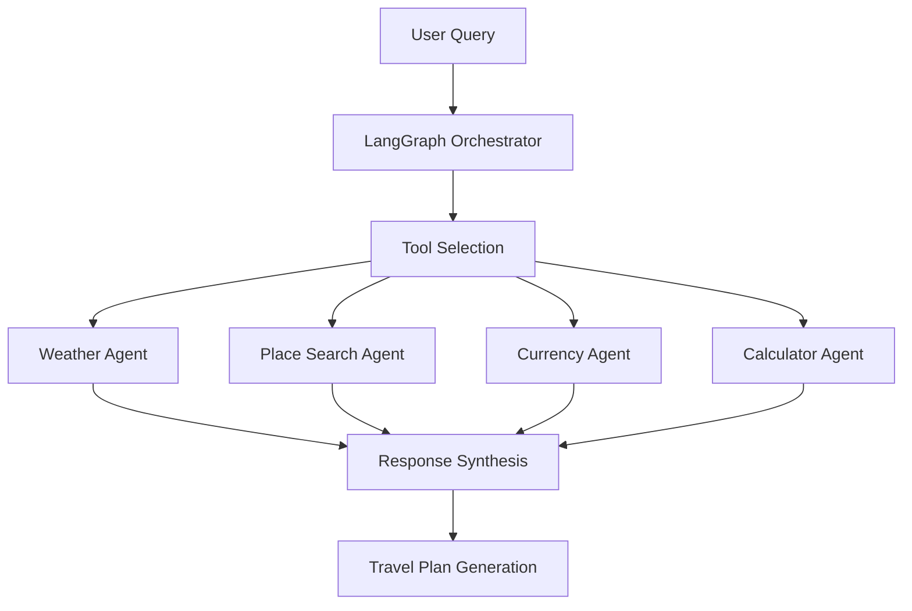

# 🤵‍♂️ Travel Butler AI Agent
> Intelligent travel planning assistant using collaborative AI agents with real-time data integration and LangGraph orchestration

[](https://www.python.org/downloads/)
[](https://fastapi.tiangolo.com)
[](https://streamlit.io)
[](https://github.com/langchain-ai/langgraph)
[](https://python.langchain.com/)

## 🚀 Overview

The Travel Butler AI Agent is a sophisticated travel planning platform that leverages specialized AI agents working collaboratively to generate smart itineraries, explore destinations, calculate expenses, and provide real-time travel information. Built with modern Python frameworks and powered by LangGraph orchestration, it streamlines your entire travel planning process with intelligent automation.

### ✨ Key Features

- 🔍 **Smart Place Discovery**: Advanced search for tourist spots, attractions, and hidden gems
- 🌤 **Real-Time Weather Updates**: Live weather conditions and forecasts for any destination
- 💱 **Currency Conversion**: Real-time exchange rates and cost calculations
- 🧮 **Expense Planning**: Comprehensive trip cost estimation and budget planning
- 🤖 **Multi-Agent Architecture**: Intelligent task routing and execution using LangGraph
- 🖼 **Interactive Interface**: Clean and intuitive Streamlit-based user experience
- 📊 **Comprehensive Reports**: Detailed travel plans with day-by-day itineraries
- 🌍 **Global Coverage**: Worldwide destination support with local insights

### 🏗️ Architecture

```
┌─────────────────┐    ┌─────────────────┐    ┌─────────────────┐
│   Streamlit     │    │   FastAPI       │    │   LangGraph     │
│   Frontend      │◄──►│   Backend       │◄──►│   Orchestrator  │
└─────────────────┘    └─────────────────┘    └─────────────────┘
         │                       │                       │
         ▼                       ▼                       ▼
┌─────────────────┐    ┌─────────────────┐    ┌─────────────────┐
│   Tool Agents   │    │   External APIs │    │   AI Model      │
│   Integration   │◄──►│   (Weather/Geo) │◄──►│   (Groq/DeepSeek)│
└─────────────────┘    └─────────────────┘    └─────────────────┘
```

## 🚀 Quick Start

### Prerequisites

- Python 3.11+
- API Keys for external services:
  - **Groq API** (Required for AI model)
  - **OpenWeatherMap API** (Required for weather data)
  - **Exchange Rate API** (Required for currency conversion)
  - **Foursquare API** (Optional for enhanced place search)
  - **Tavily API** (Optional for web search)

### 1. Clone Repository

```bash
git clone <repository-url>
cd AI_Trip_Planner
```

### 2. Environment Setup

```bash
# Create virtual environment with uv (recommended)
uv venv
source venv/bin/activate   # Linux/Mac
# or
venv\Scripts\activate.bat  # Windows

# Install dependencies
uv pip install -r requirements.txt

# Alternative: Using pip
pip install -r requirements.txt
```

### 3. Configuration

Create a `.env` file in the root directory:

```env
# Required API Keys
GROQ_API_KEY=your_groq_api_key_here
OPENWEATHERMAP_API_KEY=your_openweather_api_key_here
EXCHANGE_RATE_API_KEY=your_exchange_rate_api_key_here

# Optional API Keys (for enhanced functionality)
FOURSQUARE_API_KEY=your_foursquare_api_key_here
TAVILY_API_KEY=your_tavily_api_key_here
ALPHAVANTAGE_API_KEY=your_alphavantage_api_key_here
```

### 4. Run the Application

#### Option A: Streamlit Interface (Recommended)

```bash
streamlit run streamit_app.py
```

#### Option B: FastAPI Backend + Frontend

```bash
# Terminal 1: Start FastAPI backend
uvicorn main:app --reload --port 8000

# Terminal 2: Start Streamlit frontend
streamlit run streamit_app.py --server.port 8501
```

### 5. Access Application

- **Streamlit Dashboard**: http://localhost:8501
- **FastAPI Documentation**: http://localhost:8000/docs (if running backend)
- **API Health Check**: http://localhost:8000

## 🤖 Agent System & Tools

### Specialized Tool Categories

| Tool Category | Components | Capabilities |
|---------------|------------|--------------|
| **Weather Tools** | Current Weather, Forecasts | Real-time weather data, multi-day forecasts, climate insights |
| **Place Search Tools** | Attractions, Restaurants, Activities | Foursquare integration, Tavily fallback, comprehensive POI data |
| **Currency Tools** | Real-time Conversion | Live exchange rates, multi-currency support, cost calculations |
| **Calculator Tools** | Expense Planning, Budgeting | Hotel costs, daily budgets, total trip expenses |

### Workflow Architecture



### AI Model Integration

- **Primary Model**: DeepSeek R1 Distill Llama 70B (via Groq)
- **Orchestration**: LangGraph for intelligent task routing
- **Tool Binding**: Automatic tool selection based on query context
- **Response Generation**: Comprehensive markdown-formatted travel plans

## 📊 API Reference

### Travel Planning Endpoints

#### Generate Travel Plan
```http
POST /query
Content-Type: application/json

{
  "question": "plan a 5-day trip to Tokyo with budget of $2000"
}
```

**Response:**
```json
{
  "answer": "# AI TRAVEL PLAN\n## Day-by-Day Itinerary\n..."
}
```

#### Health Check
```http
GET /
```

### Tool Functions

The system automatically selects and uses appropriate tools based on your query:

- **Weather Functions**: `get_current_weather()`, `get_weather_forecast()`
- **Place Search**: `search_attractions()`, `search_restaurants()`, `search_activities()`, `search_transportation()`
- **Currency**: `convert_currency()`
- **Calculator**: `estimate_total_hotel_cost()`, `calculate_total_expense()`, `calculate_daily_expense_budget()`

## 🔧 Configuration

### Model Configuration (`config/config.yaml`)

```yaml
llm:
  groq:
    provider: "groq"
    model_name: "deepseek-r1-distill-llama-70b"
```

### Environment Variables

| Variable | Description | Required |
|----------|-------------|----------|
| `GROQ_API_KEY` | Groq API key for AI model access | Yes |
| `OPENWEATHERMAP_API_KEY` | OpenWeatherMap API for weather data | Yes |
| `EXCHANGE_RATE_API_KEY` | Exchange rate API for currency conversion | Yes |
| `FOURSQUARE_API_KEY` | Foursquare API for enhanced place search | No |
| `TAVILY_API_KEY` | Tavily API for web search fallback | No |
| `ALPHAVANTAGE_API_KEY` | Alpha Vantage API for financial data | No |

## 🏗️ Project Structure

```
AI_Trip_Planner/
├── main.py                     # FastAPI backend entry point
├── streamit_app.py            # Streamlit frontend application
├── requirements.txt           # Python dependencies
├── setup.py                   # Package setup configuration
├── pyproject.toml            # Build configuration
│
├── agent/                     # Core agent logic
│   └── agentic_workflow.py   # LangGraph workflow orchestration
│
├── tools/                     # Specialized tool implementations
│   ├── place_search_tool.py  # Location and attraction search
│   ├── weather_info_tool.py  # Weather data integration
│   ├── currency_conversion_tool.py # Currency exchange tools
│   └── expense_calculator_tool.py  # Trip cost calculations
│
├── utils/                     # Core utility functions
│   ├── place_info_search.py  # Place search implementations
│   ├── weather_info.py       # Weather API integration
│   ├── currency_converter.py # Currency conversion logic
│   ├── expense_calculator.py # Cost calculation utilities
│   ├── model_loader.py       # AI model configuration
│   ├── config_loader.py      # Configuration management
│   └── save_to_document.py   # Document export functionality
│
├── config/                    # Configuration files
│   └── config.yaml           # Model and API configuration
│
├── prompt_library/           # AI prompt templates
│   └── prompt.py            # System prompts for travel planning
│
├── logger/                   # Logging configuration
│   └── logging.py           # Custom logging setup
│
├── exception/               # Error handling
│   └── exceptionhandling.py # Custom exception classes
│
└── notebook/               # Development and testing
    └── exp.ipynb          # Experimental notebooks
```

## 🎯 Usage Examples

### Basic Trip Planning
```python
# Via API
{
  "question": "Plan a 3-day trip to Paris with a budget of $1500"
}
```

### Specific Queries
```python
# Weather-focused
{
  "question": "What's the weather like in Tokyo next week?"
}

# Activity-focused
{
  "question": "Find the best restaurants and activities in Rome"
}

# Budget-focused
{
  "question": "Calculate expenses for a 7-day trip to Thailand with hotel costs of $50 per night"
}
```

### Generated Travel Plans Include:

- **Complete Day-by-Day Itinerary**: Structured daily activities and schedules
- **Accommodation Recommendations**: Hotels with pricing and location details
- **Attraction Details**: Tourist spots with descriptions and timing
- **Restaurant Suggestions**: Local dining options with price ranges
- **Activity Recommendations**: Things to do with detailed information
- **Transportation Options**: Available transport modes with details
- **Detailed Cost Breakdown**: Comprehensive expense analysis
- **Daily Budget Planning**: Per-day expense estimates
- **Weather Information**: Current conditions and forecasts

## 🧪 Testing & Development

### Running Tests
```bash
# Install test dependencies
pip install pytest pytest-asyncio

# Run tests (when implemented)
pytest tests/ -v
```

### Development Mode
```bash
# Run with auto-reload
uvicorn main:app --reload --port 8000

# Run Streamlit with auto-reload
streamlit run streamit_app.py --server.runOnSave true
```

### Jupyter Notebook Development
```bash
# Launch Jupyter for experimentation
jupyter notebook notebook/exp.ipynb
```

## 📦 Installation & Dependencies

### Core Dependencies
- **LangChain**: AI agent framework and tool integration
- **LangGraph**: Workflow orchestration and state management
- **FastAPI**: High-performance web framework
- **Streamlit**: Interactive web application framework
- **Pydantic**: Data validation and settings management
- **Requests**: HTTP client for API integrations

### External Service Dependencies
- **Groq**: AI model inference
- **OpenWeatherMap**: Weather data
- **Exchange Rate API**: Currency conversion
- **Foursquare**: Place and business data
- **Tavily**: Web search capabilities

## 🚀 Deployment

### Local Development
1. Clone repository and install dependencies
2. Configure API keys in `.env` file
3. Run with `streamlit run streamit_app.py`

## 🆘 Support & Documentation

- **API Documentation**: Visit `/docs` endpoint when running FastAPI
- **Issues**: Submit via GitHub Issues
- **Feature Requests**: Use GitHub Discussions
- **Questions**: Check existing issues or create new ones

## 🎨 Features in Detail

### 🌟 Intelligent Travel Planning
- **Dual Itinerary Generation**: Generic tourist spots + off-beat locations
- **Comprehensive Cost Analysis**: Detailed breakdown of all expenses
- **Weather-Aware Planning**: Activities recommended based on weather conditions
- **Local Insights**: Authentic recommendations from local data sources

### 🔧 Technical Excellence
- **Robust Error Handling**: Graceful fallbacks for API failures
- **Real-time Data**: Always up-to-date information from live APIs
- **Scalable Architecture**: Modular design for easy feature additions
- **Developer Friendly**: Well-documented code and clear project structure
